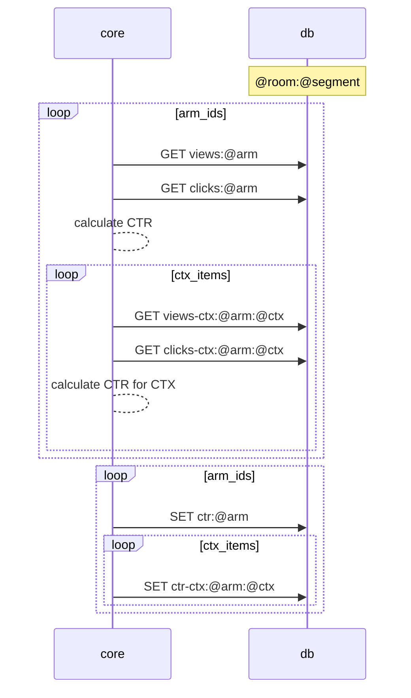
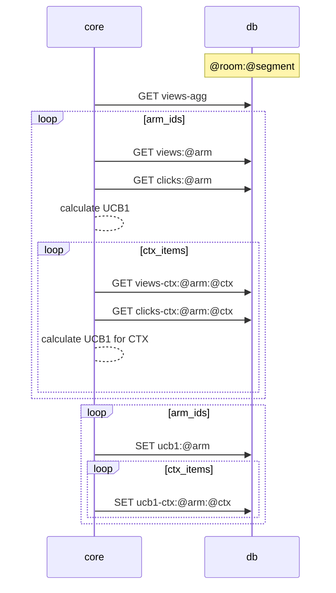
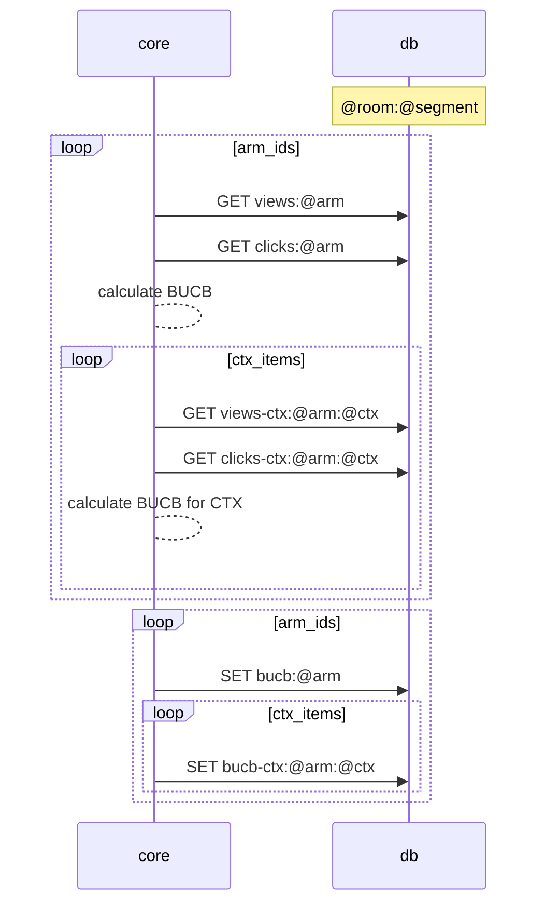

# Kraken

Kraken is a Contextual Bandits engine designed for:

- Simplicity: Easy to use and understand.
- Ease of deployment: Quickly deployable on various platforms with minimal configuration.
- Ease of scaling: Designed to be AWS lambda friendly, making it scalable and efficient.

Features include:

- multiple experiments (also known as rooms)
- segmentation for more granular control and analysis
- experiment simulator (with context)


## Installation

**NOTE**: This is experimental software. The design, functionality, and interface can change without any notice.

To install Kraken, you can use the pip command as follows:

```
TODO: pip install git+https://github.com/mobarski/kraken.git
```


## Glossary


**arm** - An option or variant in a multi-armed bandit experiment. Each arm represents a different version of a product,  feature, or strategy.

**room** - A term used to denote a unique experiment or test scenario within the Kraken system. Each room can contain multiple arms.

**pool** - A set of arms available in a specific room. It represents the different variations of an experiment that are  currently active.

**view** - The action of a user seeing or being presented with a variant (arm). This is tracked to understand the  exposure of each arm in the experiment.

**click** - The action of a user interacting with or choosing a variant (arm). This is an indication of preference and is  used to adjust the probability distribution of the arms.

**context** - The information about the current situation of a user. This can include user attributes, time of day, location, and more. The context is used to personalize the experience for each user.

**segment** - A subset of the context that is defined by a specific set of characteristics. Each segment has separate tracking of statistics (clicks/views) allowing for more targeted analysis and personalization.


## Diagrams


### Calculate CTR

CTR = arm_clicks / arm_views




### Calculate UCB1

UCB1 = ctr + alpha * sqrt(2*log(all_arms_views)) / arm_views

alpha: exploration weight, default=1.0



### Calculate BUCB (Bayesian UCB)

BUCB = ctr + zscore * sigma

sigma = sqrt(ctr*(1-ctr)/arm_views)

zscore: confidence level for normal distribution, 1.96 for 95%




## References

