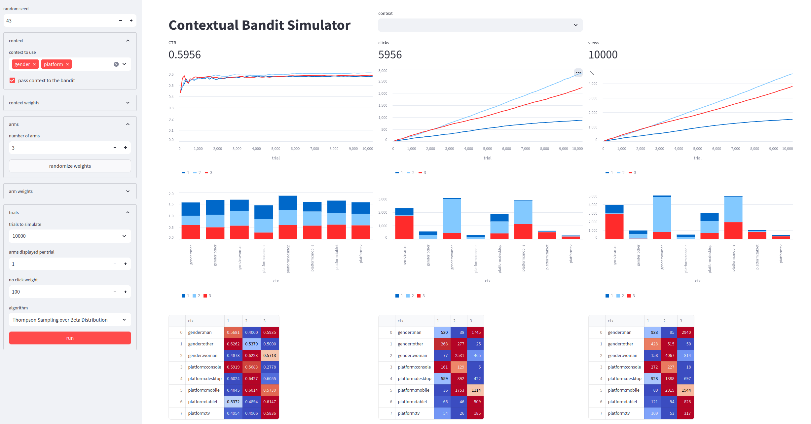
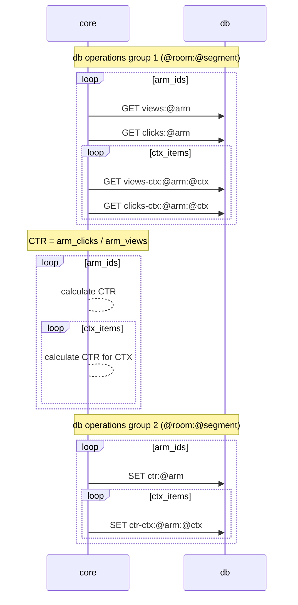
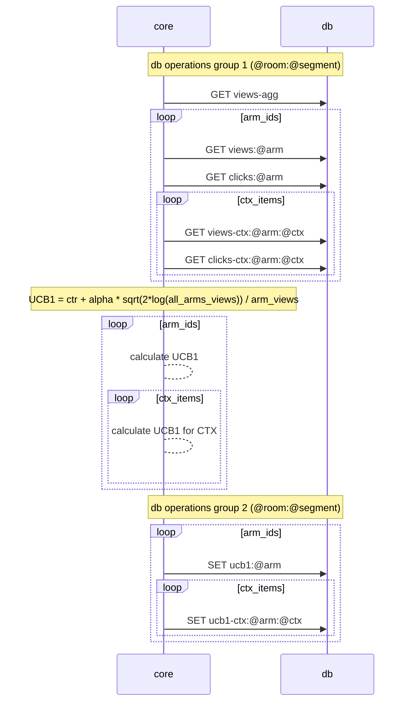
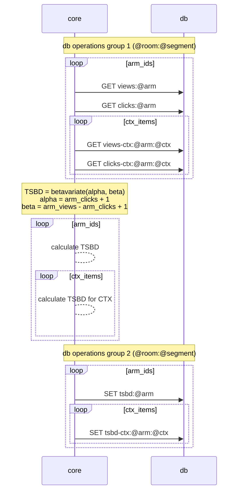

# Kraken

Kraken is a Contextual Bandits engine designed for:

- Simplicity + Power:
  - powerful features achieved in a simple way

- Ease of deployment:
  - minimal configuration
  - no dependencies other than DB connectors (+streamlit for GUI)
  - minimal components: stateless worker + DB

- Ease of scaling:
  - stateless core - serverless friendly
  - easily sharded db keys - Redis cluster friendly


Features include:

- multiple experiments (also known as rooms)
- multiple algorithms (Epsilon Greedy, UCB1, Thompson Sampling over Beta Distribution)
- context handling
- segmentation for more granular control and analysis
- dynamic item pool
- GUI for Monte Carlo simulator


Features not yet included:

- storing configuration in the DB itself
- arm decay handling
- related experiments





## Installation

**NOTE**: This is experimental software. The design, functionality, and interface can change without any notice.

To install Kraken, you can use the pip command as follows:

```
TODO: pip install git+https://github.com/mobarski/kraken.git
```


## Glossary


**arm** - An option/variant/item/action in a multi-armed bandit experiment. Each arm represents a different version of a product,  feature, or strategy.

**room** - A term used to denote a unique experiment or test scenario within the Kraken system. Each room can contain multiple arms.

**pool** - A set of arms available in a specific room. It represents the different variations of an experiment that are  currently active.

**context** - The information about the current situation of a user. This can include user attributes, time of day, location, and more. The context is used to personalize the experience for each user.

**segment** - A subset of the context that is defined by a specific set of characteristics. Each segment has separate tracking of statistics (clicks/views) allowing for more targeted analysis and personalization.

**view** - The action of a user seeing or being presented with a variant (arm). This is tracked to understand the  exposure of each arm in the experiment.

**click** - The action of a user interacting with or choosing a variant (arm). This is an indication of preference and is  used to adjust the probability distribution of the arms.


## Diagrams


### CTR calculation (for Epsilon Greedy algorithm)

CTR = arm_clicks / arm_views




### UCB1 (Upper Confidence Bound 1) calculation

UCB1 = ctr + alpha * sqrt(2*log(all_arms_views)) / arm_views

alpha: exploration weight, default=1.0




### TSBD (Thompson Sampling over Beta Distribution) calculation

TSBD = betavariate(alpha, beta)

alpha = arm_clicks + 1

beta = arm_views - arm_clicks + 1





## Notes

### Example Use Cases

**Simple**:

- optimize articles to show in a section
- optimize article's title
- optimize article's cover
- optimize which section to show (arm_id = section_id)

**Advanced**:

- optimize article's title AND cover (2 related experiments)
- optimize article's title/cover AND which articles to show in a section (3 related experiments)
- optimize article's title AND cover AND which articles to show in a section (3 related experiments)
- optimize articles to show in many sections (many unrelated experiments)

### Reporting needs

**optimize article's title/photo** (small number of arms)

- context-free:
  - CTR of each ARM
  - VIEWS of each ARM
  - CLICKS of each ARM
- contextual
  - CTR of each CTX
  - VIEWS of each CTX
  - CLICKS of each CTX
  - CTR of each ARM for CTX
  - VIEWS of each ARM for CTX
  - CLICKS of each ARM for CTX

- contextual - segmented
  - TODO


## References

- [Lihong Li et al. - A Contextual-Bandit Approach to Personalized News Article Recommendation](https://arxiv.org/abs/1003.0146)
- [DeepMind x UCL - Reinforcement Learning Lecture Series 2021](https://www.deepmind.com/learning-resources/reinforcement-learning-lecture-series-2021)
  - [Lecture 2: Exploration & Control (video)](https://www.youtube.com/watch?v=aQJP3Z2Ho8U)
  - [Lecture 2: Exploration & Control (slides)](https://storage.googleapis.com/deepmind-media/UCL%20x%20DeepMind%202021/Lecture%202-%20Exploration%20and%20control_slides.pdf)
- [Alina Beygelzimer, John Langford - Learning for Contextual Bandits](https://www.hunch.net/~exploration_learning/main.pdf)
- [James LeDoux - Multi-Armed Bandits in Python: Epsilon Greedy, UCB1, Bayesian UCB, and EXP3](https://jamesrledoux.com/algorithms/bandit-algorithms-epsilon-ucb-exp-python/)
- [Elaine Zhang - Comparing Multi-Armed Bandit Algorithms on Marketing Use Cases](https://towardsdatascience.com/comparing-multi-armed-bandit-algorithms-on-marketing-use-cases-8de62a851831)

- [John White - Bandit Algorithms for Website Optimization: Developing, Deploying, and Debugging](https://www.amazon.com/Bandit-Algorithms-Website-Optimization-Developing/dp/1449341330)
